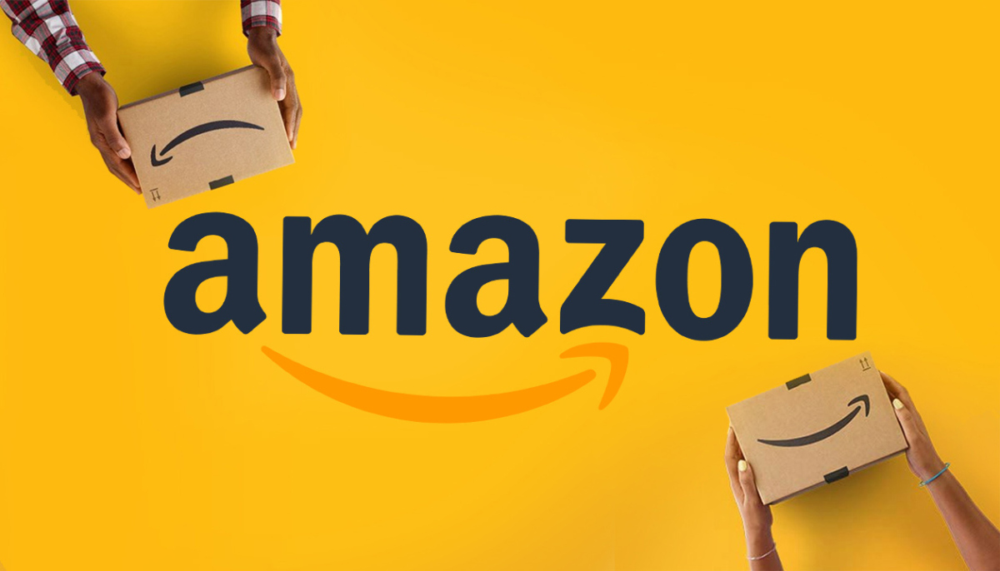

# Amazon clone Proeject

<a href="https://shopping-mall-project.vercel.app/">프로젝트 보러가기</a>

---

## 프로젝트 기간
2021.5.21 ~ 2021.5.25

___

## 선택 이유

> - inflearn과 유튜브 강의를 듣고 간단한 클론코딩을 진행했습니다.

___

## 기능 구현
> - 리덕스 상태 관리
> - 모바일 퍼스트(반응형 작업)
> - 구글 로그인
> - 장바구니
> - Next.js 이용한 SSR (index page)

## 사용된 기술
>* 프론트
>   - Next framework
>   - 상태관리 : 리덕스(redux-toolkit을 이용해서 리덕스 사용해보기)
>   - 스타일링 : tailwind css library
>   - @stripe/stripe-js로 결제 모듈 사용
>* 백엔드
>   - 파이어베이스를 이용하여 데이터와 이미지 저장. 구글 로그인 기능 구현
>   - vercel을 통한 배포

---

## 프로젝트를 통해 경험한 것들

>- 테일윈드 css를 사용해 스타일링을 적용했습니다.
>- 리액트 프레임워크인 Next.js를 사용해 서버 사이드 렌더링을 진행해 봤습니다. 
>- vercel을 통해 배포했습니다.

## 아쉬웠던 점
>- Next.js의 기능을 많이 사용하지 못했습니다.
>- 결제 기능을 끝까지 완성하지 못한 점이 아쉽습니다.

